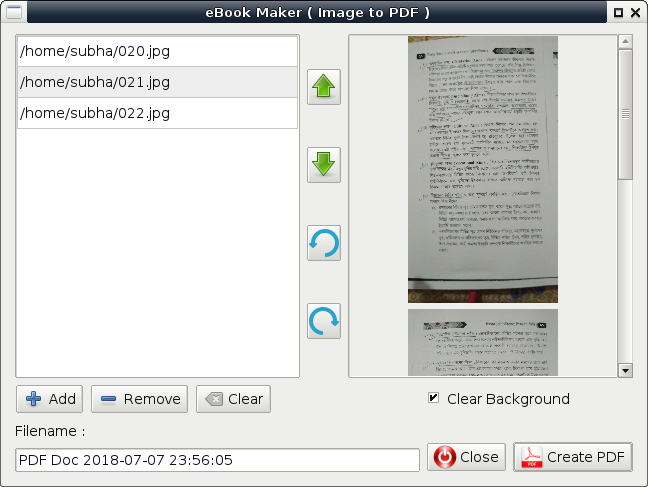

# eBook Maker
Images to PDF converter written in PyQt5  

### Dependencies
 * python-pyqt5
 * imagemagick
 * poppler-utils

### Install
Open terminal and change directory to ebook-maker-master. Then run...  
`pip install --user .`  

### Uninstall
`pip uninstall ebook-maker`  

### How to Convert
To convert to PDF, select the images and right click in file manager and select _Open With..._ eBook Maker  

Or in a terminal type...  
`ebookmaker image1.jpg image2.jpg`  

### Features
 * Rotate Pages  
 * Clean Background (unpaper)  
 * Reorder pages  

### Screenshot
